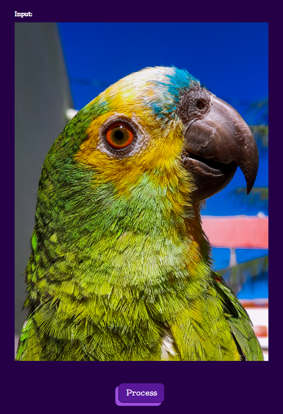

# Processamento de Imagens: Multi-thread vs Single-thread

## Explicação do Projeto

Este projeto compara o desempenho de processamento de imagens utilizando **múltiplas threads** e **thread única**.  
A aplicação permite configurar a forma como o processamento será realizado e exibe em tempo real os resultados, tanto em termos visuais quanto em tempos de execução (em milissegundos).

O principal objetivo é demonstrar como a divisão de trabalho entre threads pode acelerar operações comuns de processamento de imagens.

---

## Inputs de Configuração


### 1. Opção de Espaço de Cor
O usuário pode selecionar o espaço de cor da imagem de entrada antes do processamento:
- **RGB** (original, padrão)
- **Grayscale** (preto e branco)
- **HSV** (matiz, saturação e valor)

A conversão é feita automaticamente conforme a seleção.

### 2. Quantidade de Threads


Configuração da quantidade de threads para o processamento paralelo:
- Faixa permitida: **[2, N-2]**, onde:
  - `N` é o número total de threads disponíveis no sistema (ex.: núcleos de CPU).
- Garante que o sistema não fique sobrecarregado, reservando ao menos duas threads livres (que também são usadas).

  
### 3. Opções de Filtros e Máscaras

O usuário pode escolher o tipo de processamento aplicado à imagem:

- **Filtros**:
  - Negativo
  - Blur (Média)
  - Nitidez
  - Escala de Cinza
  - Mediana
  - Gaussiano

- **Máscaras**:
  - Laplaciano sharpen 90 (realce de detalhes, sem diagonais)
  - Laplaciano sharpen 45 (realce de detalhes, com diagonais)
  - Laplaciano detecção de bordas 90
  - Laplaciano detecção de bordas 45

### 4. Intensidade do Filtro Aplicado
Permite controlar o grau de aplicação do filtro, como:
- Tamanho do kernel (ex.: 3x3, 5x5, 7x7).
- Peso de filtros

> A intensidade afeta diretamente a suavização, nitidez ou detecção de bordas no resultado final.

---

## Input da Imagem



- Upload manual de uma imagem via botão **"Input"**.
- Visualização imediata da imagem carregada.
- Após configurar todas as opções, clique no botão **"Process"** para iniciar o processamento.

---

## Output em Tempo Real


A tela de saída exibe lado a lado:

- **Imagem processada com Multi-thread**
- **Imagem processada com Single-thread**

Para cada resultado:

- O tempo de execução é atualizado em **tempo real**, em **milissegundos (ms)**.
- Ao passar o mouse (**hover**) sobre a imagem processada:
  - Surge um botão para **download** do resultado.

Isso permite comparar tanto a **qualidade visual** quanto o **desempenho** entre as abordagens.

---


# Instruções para Compilação e Execução do Projeto

Este projeto utiliza um **Makefile** para simplificar o processo de instalação, compilação e execução do programa de processamento de imagens com suporte a **multi-thread** e **single-thread**.

---

## Requisitos

Antes de iniciar, certifique-se de ter:

- **Sistema operacional Linux** (Ubuntu/Debian ou similar).
- **Permissão de superusuário (sudo)** para instalar pacotes.
- **Compilador GCC** instalado.
- **Biblioteca OpenCV 4** instalada.

---

## Comandos Disponíveis

O `Makefile` possui os seguintes alvos:

### `make all`
Executa a sequência completa:
1. Atualiza a lista de pacotes (`sudo apt update`).
2. Instala ferramentas de compilação (`build-essential`).
3. Instala a biblioteca OpenCV (`libopencv-dev`).
4. Compila o código (`server.cpp`) gerando o executável chamado `programa`.
5. Limpa o terminal.
6. Executa o programa.

### `make update`
Atualiza o sistema e instala ferramentas básicas de compilação:
```bash
sudo apt update
sudo apt install build-essential
```

### `make install`
Instala a biblioteca OpenCV necessária para o projeto:
```bash
sudo apt install -y libopencv-dev
```

### `make programa`
Compila o código-fonte `server.cpp` gerando o executável `programa`:
```bash
g++ server.cpp -o programa `pkg-config --cflags --libs opencv4` -lpthread
```
- Usa `pkg-config` para localizar as flags do OpenCV.
- Linka também a biblioteca de threads (`-lpthread`).

### `make run`
Executa o programa compilado:
```bash
./programa
```

### `make clean`
Remove o executável `programa`:
```bash
rm -f programa
```

### `make clean_terminal`
Limpa o terminal:
```bash
clear
```

---

## Passo a Passo para Rodar o Projeto

1. **Clone o repositório** (se aplicável).
2. **Entre no diretório do projeto**.
3. **Execute**:
   ```bash
   make all
   ```
4. **O programa irá iniciar automaticamente** após a instalação e compilação.

---

## Observações

- Caso o OpenCV já esteja instalado, o `make install` será ignorado sem causar problemas.
- O código é preparado para rodar em sistemas com suporte a múltiplas threads, para aproveitar o processamento paralelo.

---

### Distribuição de Tarefas

- Herick
    - Implementação do arquivo `image.hpp`;
      - Incluindo criação de filtros e máscaras;
      - Incluindo utilização de threads;
    - Documentação de código.

- Lael
    - Front-end e interatividade;
    - Formulação da logística da manipulação de threads;
    - Criação da função de distribuição de regiões para as threads;
    - Documentação de código.

- Luis
    - Implementação do arquivo `ThreadPool.hpp`;
    - Criação de filtros;
    - Comunicação front/back;
    - Documentação de código.
